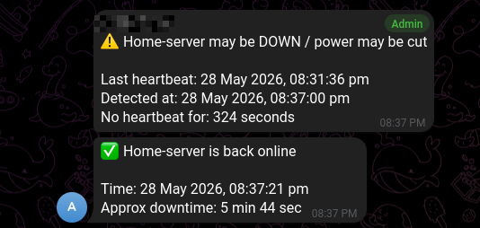

# CF Edge Watcher

CF Edge Watcher is a lightweight power/server monitoring tool for homelab users.

It sends heartbeat pings from your local server to a Cloudflare Worker. If the local server loses power, internet, or becomes unreachable, Cloudflare detects the missing heartbeat and sends a Telegram alert. When the server comes back online, it sends a message as server is available.

No port forwarding. No public IP required.

---

## Features

- Detects server unreachable / possible power cut
- Sends Telegram alert when heartbeat is missed
- Sends recovery alert when server comes back online
- Runs local heartbeat as a Docker container
- Uses Cloudflare Worker as the cloud monitor
- Uses Cloudflare KV for state storage
- Works behind CGNAT
- No inbound access required to your home server
- One-command Cloudflare setup using API token
- Simple `.env` based configuration

---
## Architecture

```text
Local Server Docker Agent
        |
        | heartbeat every N seconds
        v
Cloudflare Worker /heartbeat
        |
        v
Cloudflare KV stores latest server status
        |
        | Cron trigger checks heartbeat age
        v
Telegram alert

```

---
## Screenshot

<p align="center">

</p>

---


# Quick Start

## 1. Clone the repository

```bash
git clone https://github.com/creator1021/CF-edge-watcher.git
cd CF-edge-watcher
```

---

## 2. Create `.env`

```bash
cp .env.example .env
nano .env
```

Example:

```env
CLOUDFLARE_ACCOUNT_ID="clouflare account ID" # change me
CLOUDFLARE_API_TOKEN="cloudflare API Token" # change me

WORKER_NAME="cloudflare-edge-watcher"
KV_BINDING="POWER_KV"
KV_NAMESPACE_TITLE="cloudflare-worker"

SERVER_ID="home-server"
SERVER_NAME="Home-server"
THRESHOLD_SECONDS="180" # If It didn't get the heartbeat (Ping) after 3 min (180 sec) it will send the message to telegram # If you want change me
CRON_EXPRESSION="*/1 * * * *" # cloudflare will every min for the status #If you want change me

TELEGRAM_BOT_TOKEN="Telegram bot token" #change me
TELEGRAM_CHAT_ID=" Telegram chat ID it will start with "-" " #change me
HEARTBEAT_SECRET="(Run this command in the linux terminal "openssl rand -hex 32" and paste the output here)" #change me

INTERVAL_SECONDS="60" # In your local server it will do curl in every 60 sec # If you want change me
```

---

# Cloudflare Setup

## 2.1. Get `CLOUDFLARE_ACCOUNT_ID`

1. Go to the Cloudflare Dashboard.
2. On the left top side, use the **Quick Search** option.
3. Search for:

```text
Account ID
```

4. Cloudflare will show a suggestion to copy your **Account ID**.
5. Copy the value and add it to your `.env` file:

```env
CLOUDFLARE_ACCOUNT_ID="your_cloudflare_account_id"
```

---

## 2.2. Create `CLOUDFLARE_API_TOKEN`

1. Go to the Cloudflare Dashboard.
2. On the right top side, click your **Profile icon**.
3. Go to:

```text
Profile → API Tokens
```

4. Click:

```text
Create Token
```

5. Select:

```text
Create Custom Token
```

6. Give the token a name, for example:

```text
cloudflare-edge-watcher
```

---

## 2.3. Add Required Permissions

Under **Permissions**, add the following:

| Scope | Resource | Permission |
|---|---|---|
| Account | Workers KV Storage | Edit |
| Account | Workers Scripts | Edit |

Leave the remaining settings as default.

---

## 2.4. Generate and Copy Token

1. Click:

```text
Continue to summary
```

2. Review the permissions.
3. Click:

```text
Create Token
```

4. Copy the generated API token.

Add it to your `.env` file:

```env
CLOUDFLARE_API_TOKEN="your_cloudflare_api_token"
```

---

## Final `.env` Example

```env
CLOUDFLARE_ACCOUNT_ID="your_cloudflare_account_id"
CLOUDFLARE_API_TOKEN="your_cloudflare_api_token"
```

---

## Recommended Values

```env
INTERVAL_SECONDS="60"
CRON_EXPRESSION="*/1 * * * *"
THRESHOLD_SECONDS="180"
```

Meaning:

| Setting | Meaning |
|---|---|
| `INTERVAL_SECONDS=60` | Local Docker agent sends heartbeat every 1 minutes |
| `CRON_EXPRESSION="*/1 * * * *"` | Cloudflare Worker checks every 1 minutes |
| `THRESHOLD_SECONDS=180` | Alert is sent after around 3 minutes without heartbeat |

---

## 3. Run Cloudflare worker setup script

```bash
chmod +x scripts/cf-edge-watcher-setup.sh
./scripts/cf-edge-watcher-setup.sh
```

This will:

- Create the Cloudflare KV namespace if needed
- Generate `worker/wrangler.toml`
- Upload Worker secrets
- Deploy the Cloudflare Worker
- Generate `local/.env` for Docker

---

## 4. Start the local Docker agent

```bash
docker compose up -d 
```

Check logs:

```bash
docker logs -f cf-edge-watcher
```

Expected output:

```text
Heartbeat container started
Worker URL: https://your-worker.your-subdomain.workers.dev
Server name: Home-server
Interval seconds: 60
```
